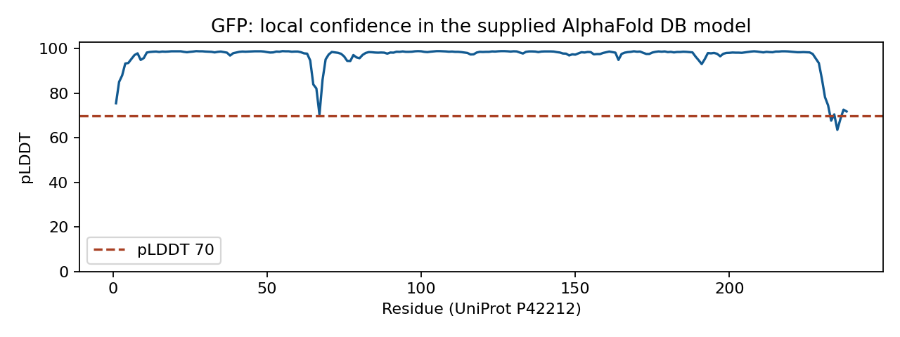
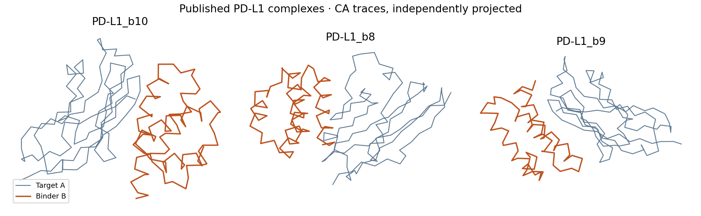

Start with the **GFP confidence task** for structure prediction. Use the **published binder task** for design and capstone analysis. Both downloads contain real source structures, ready-to-read figures, editable worksheets, provenance, and checksums. All reading and worksheet tasks work offline after download.

## GFP confidence {#gfp-confidence}

[Download GFP analysis dataset](files/gfp-analysis.zip){.btn .btn-primary download=""}

**Time:** 20 minutes for a first interpretation; 60–90 minutes for the full lesson evidence. **Compute:** none. A molecular viewer is optional for the first task.

1. Unzip the download and open `plddt.png` and `pae.png`.
2. Identify one confident region and one uncertainty. Record residue numbers and the evidence behind your answer.
3. Fill in `evidence-template.csv` using any spreadsheet or text editor; leave unavailable values as **N/A**, with a reason.
4. Write a three-sentence trust statement. Then compare it with `completed-example.md`.
5. If you have PyMOL, load `gfp.pdb` and follow the [AlphaFold2 analysis steps](tuesday/3-alphafold2.qmd#do-analyze-local-confidence). The experimental comparison requires fetching 1GFL; if offline, explicitly record that comparison as not measured.

{.analysis-preview fig-alt="GFP pLDDT is high across most residues, with lower confidence near the termini. Numerical values are in residue-confidence.csv."}

This unchanged [AlphaFold DB GFP model (P42212)](https://alphafold.ebi.ac.uk/entry/P42212), version 6, uses the same 238-residue sequence as the course lab. The download includes the database's confidence and PAE files. It is **not a new ColabFold run**: pTM, runtime and original MSA depth are not supplied. Do not substitute an average PAE for pTM or report invented runtime. Source data: Google DeepMind / EMBL-EBI, CC BY 4.0; retrieved September 19, 2026.

**Your evidence:** completed confidence table and trust statement, with provenance. This satisfies the analysis alternative for the [AlphaFold2 lesson](tuesday/3-alphafold2.qmd). Mark that lesson's evidence checkpoint after saving your work.

## Published binder evidence {#binder-evidence}

[Download PD-L1 binder analysis dataset](files/binder-analysis.zip){.btn .btn-primary download=""}

**Time:** 20 minutes for an initial comparison; use the seven-stage workbook for the capstone. **Compute:** none. PyMOL is optional for the initial gallery and table comparison.

1. Open `candidate-gallery.png` and `candidate-comparison.csv` to compare three published PD-L1 complex models.
2. State a selection rule before choosing a candidate. Compare CA-contact counts at 6, 8 and 10 Å, and account for binder length. These are geometry proxies, not binding-affinity scores.
3. Inspect `binder-sequences.fasta` and document sequence differences. The target is chain A and binder is chain B; numbers are local to these files.
4. Complete `analysis-workbook.md`: target brief, provenance audit, backbone comparison, sequence evidence, validation limits, sensitivity analysis, and a conditional selection memo.
5. Assess your portfolio with the [analysis-mode rubric](capstone/rubric.qmd#analysis-mode-evidence).

{.analysis-preview fig-alt="Three published PD-L1 complex CA traces. Target chain A is gray and binder chain B is orange. Numerical contact comparisons are in the supplied CSV."}

The unchanged models come from Pacesa, Nickel and Correia's [BindCraft structural-model archive, version 1](https://doi.org/10.5281/zenodo.14249738), under CC BY 4.0. The course derives the gallery, chain-B sequences and CA-contact table from those models. `provenance.json` identifies the original archive and `SHA256SUMS.txt` records the bundled files. The repository's `scripts/build-analysis-data.py` reproduces the derived summaries without model inference.

::: {.callout-important}
## These are final models, not a complete campaign

The source archive does not supply raw trajectories, rejected candidates, original seeds/configuration, parent-backbone links, PAE or ipTM. Record those as **unavailable** and explain which conclusions they prevent. Do not claim a reproduced generation run, validated affinity, or experimentally successful binder. Do not copy native PD-L1 hotspot numbering into these cropped structures without a sequence mapping.
:::

For the analysis capstone, missing upstream files become an **evidence-gap audit** with a concrete next test. You still inspect all three supplied models, compare at least two finalists, test a misleading ranking assumption, and write a conditional decision. This alternative does not require inventing provenance or running a new model.

[Continue to the capstone rubric](capstone/rubric.qmd){.btn .btn-outline-primary}
