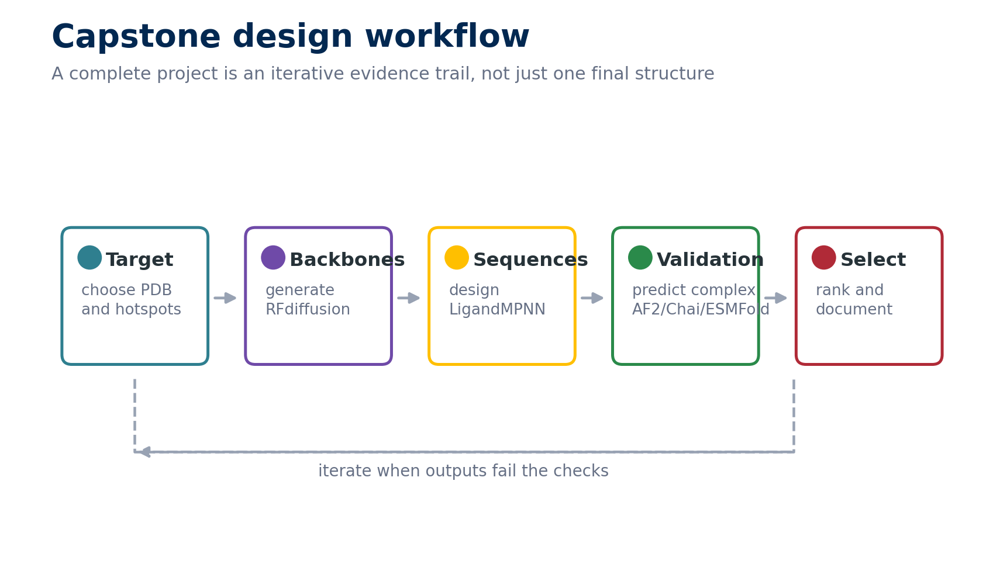
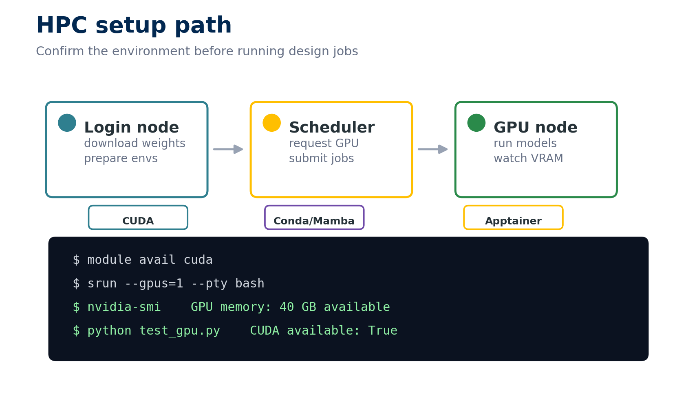
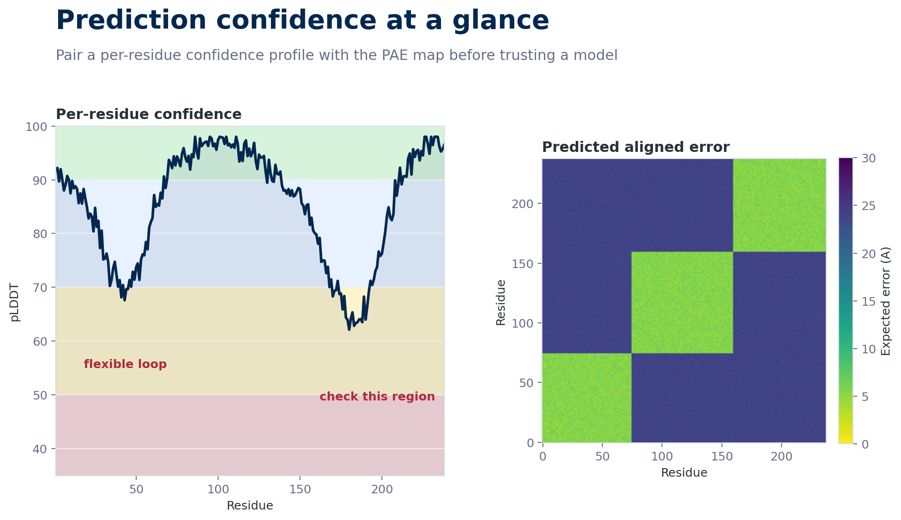
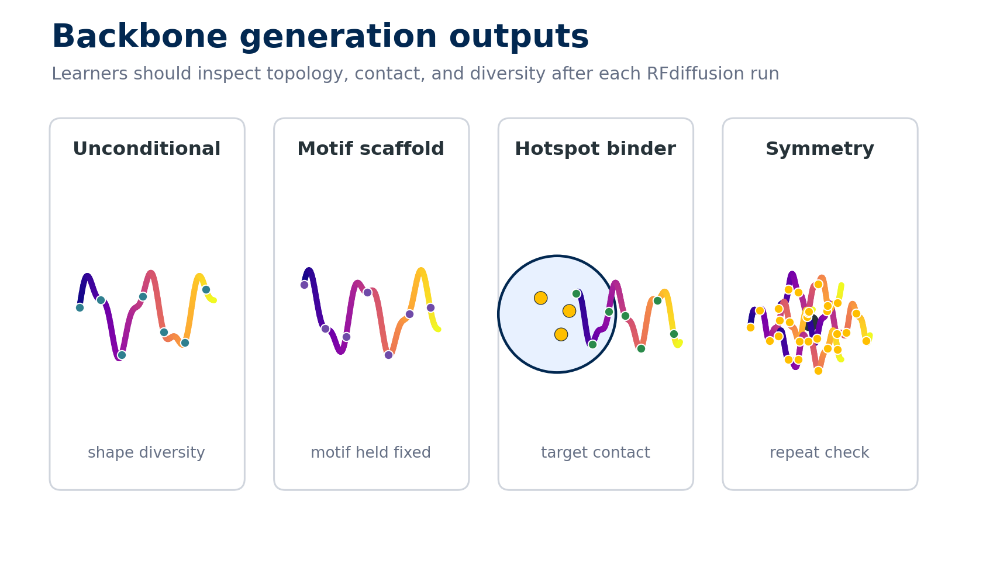
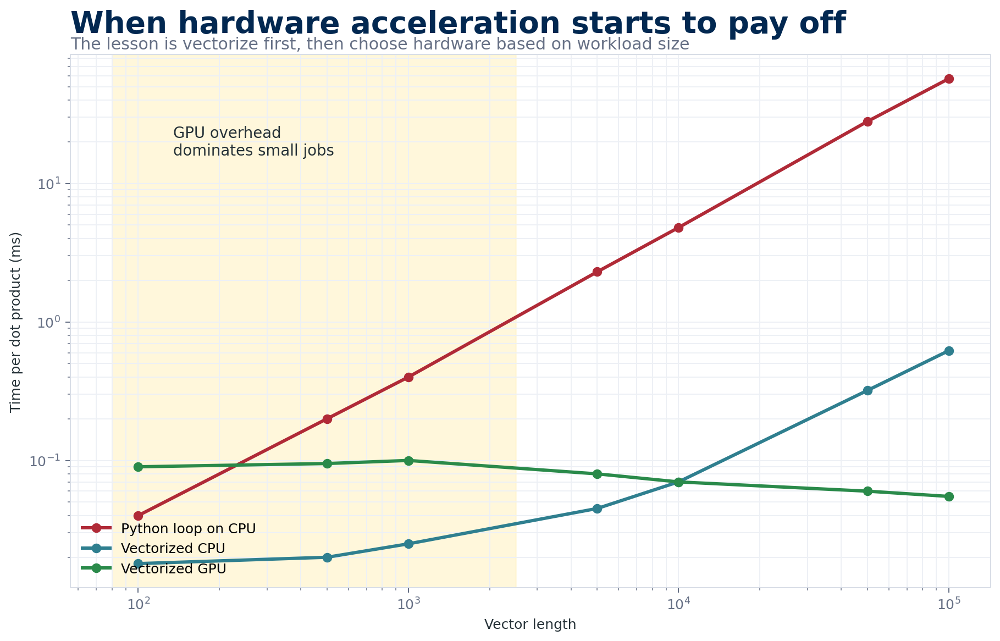
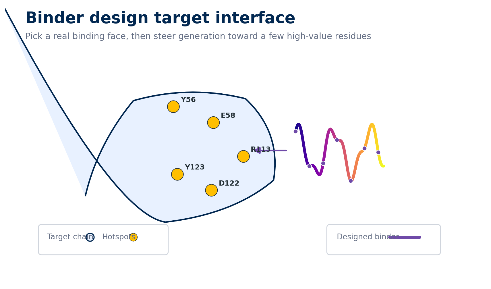

```{=html}
<div id="resume-banner" class="resume-banner" style="display: none;">
  <strong>Welcome back!</strong> You were last on: <span id="last-page-title"></span>
  <br>
  <a id="resume-link" href="#" class="btn btn-primary btn-sm resume-link">Resume where you left off</a>
</div>

<section class="course-hero">
  <div class="course-hero-copy">
    <p class="course-eyebrow">Self-paced course</p>
    <h2>Build judgment across modern ML protein design workflows.</h2>
    <p>This bootcamp moves from environment setup to structure prediction, backbone generation, docking, and a binder-design capstone. Each section is meant to produce something concrete: a configured tool, a prediction, a comparison, or a design decision.</p>
    <div class="course-hero-actions">
      <a class="btn btn-primary" href="monday/index.html">Start with Monday</a>
      <a class="btn btn-outline-primary" href="capstone/index.html">Preview capstone</a>
    </div>
  </div>
  <figure class="course-hero-visual">
    
  </figure>
</section>

<section class="course-progress-panel" id="progress-summary" data-total-modules="42">
  <div>
    <p class="course-eyebrow">Your progress</p>
    <h2>Course checkpoint tracker</h2>
    <p>Completion is saved in this browser. Use it to keep track of setup and verification steps as you move through the course.</p>
  </div>
  <div class="progress-readout">
    <div><strong><span id="completed-count">0</span></strong> completed checkpoints</div>
    <div class="progress progress-dashboard">
      <div id="progress-bar" class="progress-bar" role="progressbar" aria-label="Course completion" style="width: 0%;" aria-valuenow="0" aria-valuemin="0" aria-valuemax="100">0%</div>
    </div>
    <button onclick="clearProgress()" class="btn btn-outline-secondary btn-sm">Reset Progress</button>
  </div>
</section>
```

## Course Dashboard

```{=html}
<div class="course-dashboard">
  <a class="course-card" href="monday/index.html">
    
    <span class="course-card-body">
      <span class="course-card-meta"><span>Monday</span><span>Pre-work + 13 modules</span></span>
      <span class="course-card-title">Tool Installation</span>
      <span class="course-card-text">Set up HPC access, CUDA, conda environments, containers, and the core prediction and design tools.</span>
      <span class="course-card-footer"><span class="course-badge required">Required foundation</span><span>Open Monday -></span></span>
    </span>
  </a>

  <a class="course-card" href="tuesday/index.html">
    
    <span class="course-card-body">
      <span class="course-card-meta"><span>Tuesday</span><span>4 modules</span></span>
      <span class="course-card-title">Structure Prediction</span>
      <span class="course-card-text">Use PyMOL, AlphaFold2, and ESMFold to predict structures and interpret confidence instead of treating outputs as answers.</span>
      <span class="course-card-footer"><span class="course-badge analysis">Analysis heavy</span><span>Open Tuesday -></span></span>
    </span>
  </a>

  <a class="course-card" href="wednesday/index.html">
    
    <span class="course-card-body">
      <span class="course-card-meta"><span>Wednesday</span><span>2 modules</span></span>
      <span class="course-card-title">Advanced Prediction and Design</span>
      <span class="course-card-text">Compare complex prediction tools, then generate and inspect protein backbones with RFdiffusion workflows.</span>
      <span class="course-card-footer"><span class="course-badge design">Design workflow</span><span>Open Wednesday -></span></span>
    </span>
  </a>

  <a class="course-card" href="thursday/index.html">
    
    <span class="course-card-body">
      <span class="course-card-meta"><span>Thursday</span><span>4 modules</span></span>
      <span class="course-card-title">Compute, Docking, and Reflection</span>
      <span class="course-card-text">Connect PyTorch basics to GPU performance, docking intuition, and planning decisions for the capstone.</span>
      <span class="course-card-footer"><span class="course-badge compute">Compute intuition</span><span>Open Thursday -></span></span>
    </span>
  </a>

  <a class="course-card course-card-wide" href="capstone/index.html">
    
    <span class="course-card-body">
      <span class="course-card-meta"><span>Capstone</span><span>Curated target set</span></span>
      <span class="course-card-title">Protein Binder Design Project</span>
      <span class="course-card-text">Choose a target, define a binding face, generate binders, design sequences, validate structures, and document the rationale behind your choices.</span>
      <span class="course-card-footer"><span class="course-badge project">Project</span><span>Open Capstone -></span></span>
    </span>
  </a>
</div>
```

## Getting Started

1. Start with the **Monday HPC setup** if you have not confirmed GPU access and environment paths.
2. Move through the days in order when possible; later activities assume earlier tools and concepts.
3. Use the checkboxes on setup pages only after the command, output, or file exists.
4. Return anytime and use the resume banner to pick up where you left off.

<a href="https://github.com/RosettaMLBootCamp2025/RosettaMLBootCamp2025.github.io/issues/new" class="btn btn-primary">Report an Issue / Ask a Question (GitHub account required)</a>
